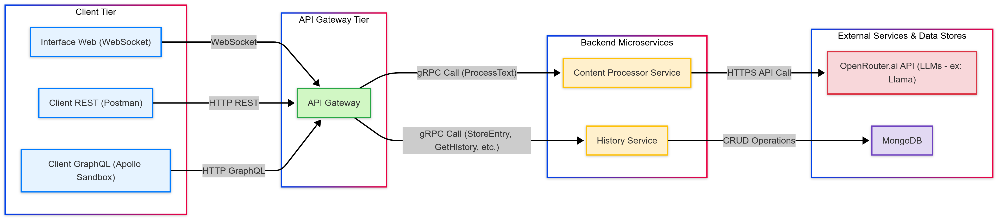

# Projet : 

## 1. Introduction
Ce projet met en œuvre une application basée sur une architecture microservices pour l'analyse de contenu textuel. Il permet aux utilisateurs de soumettre du texte afin d'obtenir une analyse de sentiment et des suggestions de mots-clés pertinentes. L'historique de ces analyses est également conservé et consultable.

L'objectif principal est de démontrer l'intégration de différentes technologies de communication (REST, GraphQL, gRPC, WebSockets) et l'orchestration de microservices via une API Gateway, avec une intégration à un LLM (via OpenRouter.ai) pour des capacités d'analyse avancées.

## 2. Architecture Détaillée

L'application est conçue autour d'une architecture microservices robuste, visant la modularité, la scalabilité et la séparation des préoccupations. Chaque composant a un rôle bien défini et communique via des protocoles adaptés à ses besoins.



### 2.1. Composants Principaux

*   **Clients (Client Tier) :**
    *   Divers types de clients peuvent interagir avec le système :
        *   **Interface Web de Test :** Une page HTML simple utilisant **WebSockets** pour une communication bidirectionnelle en temps réel avec l'API Gateway, permettant de soumettre du texte et de visualiser les résultats.
        *   **Clients REST :** Des applications externes ou des outils de test (comme Postman) peuvent interagir via des requêtes HTTP **REST** standard.
        *   **Clients GraphQL :** Des applications nécessitant une récupération de données flexible et ciblée peuvent utiliser **GraphQL**.
*   **API Gateway (`api-gateway`) :**
    *   **Rôle :** Agit comme la façade unique du système backend. Elle reçoit toutes les requêtes des clients, les authentifie (non implémenté dans ce PoC), les valide, et les route vers les microservices internes appropriés. Elle est également responsable de l'agrégation des réponses de plusieurs services si nécessaire et de la traduction de protocole (HTTP/GraphQL/WS vers gRPC).
    *   **Technologies :** Node.js, Express.js (pour les endpoints REST et le serveur HTTP de base), Apollo Server (pour l'endpoint GraphQL), `ws` (pour le serveur WebSocket), et les clients gRPC pour communiquer avec les services backend.
*   **Content Processor Service (`content-processor-service`) :**
    *   **Rôle :** Microservice spécialisé dans l'analyse sémantique du texte. Il est responsable de déterminer le sentiment et de suggérer des mots-clés pertinents.
    *   **Technologies :** Node.js, gRPC.
    *   **Communication :** Expose une interface gRPC (définie par `content_processor.proto`).
    *   **Intégration LLM :** Ce service fait appel à un Grand Modèle de Langage (LLM) externe via l'API **OpenRouter.ai**. OpenRouter permet d'accéder à divers modèles, incluant potentiellement des modèles comme **Llama**, GPT, Mistral, etc., pour effectuer l'analyse de sentiment et la génération de mots-clés. Le choix du modèle spécifique via OpenRouter peut être configuré.
*   **History Service (`history-service`) :**
    *   **Rôle :** Microservice dédié à la persistance et à la récupération de l'historique des analyses de contenu.
    *   **Technologies :** Node.js, gRPC, driver MongoDB. 
    *   **Communication :** Expose une interface gRPC (définie par `history.proto`).
    *   **Stockage :** Utilise **MongoDB** comme base de données NoSQL pour stocker les entrées d'historique de manière flexible.
*   **OpenRouter.ai (Service Externe) :**
    *   **Rôle :** Plateforme agissant comme un routeur vers divers Grands Modèles de Langage (LLM), tels que des modèles de la famille Llama, OpenAI GPT, etc. Notre `Content Processor Service` l'utilise pour déléguer les tâches complexes d'analyse de sentiment et de suggestion de mots-clés.
    *   **Communication :** Via une API HTTP RESTful.
*   **MongoDB (Base de Données) :**
    *   **Rôle :** Base de données NoSQL orientée document utilisée par le `History Service` pour stocker de manière persistante les résultats des analyses.

### 2.2. Flux de Communication et Protocoles

*   **Client vers API Gateway :**
    *   **REST :** Les clients envoient des requêtes HTTP (GET, POST, etc.) à des endpoints spécifiques sur l'API Gateway (ex: `/api/submit`). C'est un protocole sans état, bien adapté pour les opérations CRUD simples.
    *   **GraphQL :** Les clients envoient des requêtes HTTP POST à un unique endpoint `/graphql` sur l'API Gateway. Le corps de la requête contient une query ou une mutation GraphQL, permettant aux clients de demander précisément les données dont ils ont besoin.
    *   **WebSocket :** Une connexion persistante et bidirectionnelle est établie entre le client et l'API Gateway (ex: `ws://localhost:8080`). Les messages JSON sont échangés dans les deux sens pour des interactions en temps réel.
*   **API Gateway vers Microservices Backend (`Content Processor`, `History Service`) :**
    *   **gRPC :** L'API Gateway utilise gRPC pour communiquer avec les microservices internes. gRPC est un framework RPC haute performance basé sur HTTP/2 et Protocol Buffers pour la sérialisation des données.
        *   **Avantages :** Faible latence, communication binaire efficace, génération de code client/serveur à partir de définitions de service `.proto` (contrats stricts), support du streaming.
        *   **Utilisation :** L'API Gateway agit comme un client gRPC, invoquant des méthodes RPC distantes exposées par les serveurs gRPC du `Content Processor Service` et du `History Service`.
*   **Content Processor Service vers OpenRouter.ai :**
    *   **HTTPS API (RESTful) :** Le `Content Processor Service` agit comme un client HTTP pour envoyer des requêtes à l'API d'OpenRouter.ai afin d'obtenir les analyses du LLM. Les données sont typiquement échangées en JSON.
*   **History Service vers MongoDB :**
    *   Le `History Service` utilise le driver MongoDB natif pour Node.js pour effectuer des opérations CRUD (Create, Read, Update, Delete) sur la base de données.

### 2.3. Justification des Choix Technologiques

*   **Node.js :** Choisi pour sa nature non bloquante et orientée événements, bien adaptée aux I/O intensives des microservices et de l'API Gateway, ainsi qu'à la gestion des connexions WebSocket. L'écosystème npm est riche.
*   **Express.js :** Framework minimaliste et flexible pour construire les endpoints REST et servir de base au serveur HTTP de l'API Gateway.
*   **Apollo Server :** Solution populaire et robuste pour implémenter le serveur GraphQL dans l'API Gateway.
*   **`ws` (Package WebSocket) :** Bibliothèque légère pour la fonctionnalité WebSocket dans l'API Gateway.
*   **gRPC & Protocol Buffers :** Pour la communication interne, privilégiés pour leur performance, leurs contrats d'interface forts et leur adéquation aux architectures microservices polyglottes (bien que nous utilisions Node.js partout ici).
*   **OpenRouter.ai :** Offre un accès flexible à une multitude de LLM (dont des modèles comme Llama) sans avoir à gérer plusieurs intégrations API distinctes, et potentiellement une meilleure gestion des quotas/coûts agrégés.
*   **MongoDB :** Sa flexibilité de schéma est bien adaptée pour stocker les résultats d'analyse textuelle qui pourraient évoluer. Bonne scalabilité horizontale.

## 3. Description des Microservices

### 3.1. API Gateway (`api-gateway`)

*   **Rôle :** Point d'entrée central, agrégation, traduction de protocole.
*   **Technologies :** Node.js, Express.js, Apollo Server, `ws` (WebSockets), Clients gRPC.
*   **Points d'Entrée Publics :**
    *   **REST :**
        *   `POST /api/submit` : Soumettre un texte pour analyse.
            *   Request Body: `{ "text": "string", "user_id": "string" (optionnel) }`
            *   Response Body: `{ "text_id": "string", "sentiment": "string", "suggested_keywords": ["string"], "history_entry_id": "string" (optionnel), "error_message": "string" (optionnel) }`
        *   `GET /api/history` : Récupérer l'historique.
            *   Query Params: `limit` (int), `offset` (int), `user_id` (string)
            *   Response Body: `{ "entries": [HistoryEntry], "total_count": "int" }`
        *   `GET /api/history/:id` : Récupérer une entrée d'historique par son ID.
            *   Response Body: `HistoryEntry`
    *   **GraphQL :**
        *   Endpoint : `POST /graphql`
        *   **Mutations :**
            *   `submitText(text: String!, user_id: String): ProcessedTextAndHistoryId`
        *   **Queries :**
            *   `getProcessedTextHistory(limit: Int, offset: Int, userId: String): HistoryResponse`
            *   `getHistoryEntry(id: ID!): HistoryEntry`
        *   (Voir `api-gateway/src/graphql/typeDefs.js` pour le schéma complet)
    *   **WebSocket :**
        *   Endpoint : `ws://localhost:PORT` (ex: `ws://localhost:8080`)
        *   **Messages Client -> Serveur :**
            *   `{ "type": "submitText", "payload": { "text": "...", "user_id": "..." } }`
            *   `{ "type": "getHistory", "payload": { "limit": ..., "user_id": "..." } }`
        *   **Messages Serveur -> Client :**
            *   `{ "type": "submitTextResponse", "payload": { ... } }` ou `{ "type": "submitTextResponse", "error": "..." }`
            *   `{ "type": "historyResponse", "payload": { ... } }` ou `{ "type": "historyResponse", "error": "..." }`
*   **Interactions Internes :**
    *   Appelle `ContentProcessorService.ProcessText` (gRPC).
    *   Appelle `HistoryService.StoreEntry`, `HistoryService.GetHistory`, `HistoryService.GetEntryById` (gRPC).

### 3.2. Content Processor Service (`content-processor-service`)

*   **Rôle :** Analyser le texte soumis pour le sentiment et les mots-clés.
*   **Technologies :** Node.js, gRPC (`@grpc/grpc-js`), `node-fetch` (ou `fetch` natif) pour OpenRouter.ai.
*   **Interface gRPC (voir `content-processor-service/protos/content_processor.proto`) :**
    *   Service : `content_processor.ContentProcessorService`
    *   Méthode : `rpc ProcessText (ProcessTextRequest) returns (ProcessTextResponse)`
        *   `ProcessTextRequest`: `{ text_id: string, text: string }`
        *   `ProcessTextResponse`: `{ text_id: string, sentiment: string, suggested_keywords: [string], error_message: string (optionnel) }`
*   **Interactions Externes :**
    *   Appelle l'API OpenRouter.ai (`https://openrouter.ai/api/v1/chat/completions`) pour l'analyse de sentiment et la suggestion de mots-clés.

### 3.3. History Service (`history-service`)

*   **Rôle :** Gérer la persistance des données d'analyse.
*   **Technologies :** Node.js, gRPC (`@grpc/grpc-js`), MongoDB (driver `mongodb`)
*   **Interface gRPC (voir `history-service/protos/history.proto`) :**
    *   Service : `history.HistoryService`
    *   Méthodes :
        *   `rpc StoreEntry (StoreEntryRequest) returns (StoreEntryResponse)`
        *   `rpc GetHistory (GetHistoryRequest) returns (GetHistoryResponse)`
        *   `rpc GetEntryById (GetEntryByIdRequest) returns (Entry)`
*   **Schéma de Données MongoDB (Collection `history_entries`) :**
    ```json
    {
      "_id": "UUID généré par le service", 
      "original_text_id": "string",       
      "original_text": "string",
      "sentiment": "string",              
      "suggested_keywords": ["string"],
      "user_id": "string" (optionnel),
      "processed_at": ISODate            
    }
    ```
*   **Interactions Externes :**
    *   Lit et écrit dans la base de données MongoDB.

## 4. Schémas de Données Détaillés

### 4.1. Fichiers Protobuf

*   **`content_processor.proto` :**
    ```protobuf
    // Contenu complet de content_processor.proto ici
    syntax = "proto3";
    package content_processor;
    // ... (le reste du proto)
    ```
*   **`history.proto` :**
    ```protobuf
    // Contenu complet de history.proto ici
    syntax = "proto3";
    package history;
    import "google/protobuf/timestamp.proto";
    // ... (le reste du proto)
    ```

### 4.2. Schéma GraphQL (Abrégé)

(Référez-vous à `api-gateway/src/graphql/typeDefs.js` pour la version complète)
Principaux types : `ProcessedText`, `HistoryEntry`, `HistoryResponse`, `ProcessedTextAndHistoryId`.
Mutations : `submitText`.
Queries : `getProcessedTextHistory`, `getHistoryEntry`.

## 5. Configuration

*   Les configurations principales (ports, URI MongoDB, clés API) sont gérées via :
    *   Le fichier `config/app-config.json` pour les configurations non sensibles.
    *   Des fichiers `.env` (ignorés par Git) dans chaque service respectif pour les secrets (ex: `OPENROUTER_API_KEY`).
*   **Variables d'environnement clés :**
    *   `OPENROUTER_API_KEY` : Nécessaire pour `content-processor-service`.
    *   `MONGODB_URI` : (Si non défini dans `app-config.json`) implicitement utilisé par le `history-service`.
    

## 6. Installation et Démarrage
    ```bash
    npm run dev:content-processor
    npm run dev:history
    npm run dev:gateway
    ```
## 7. Guide de Test

### A. Tester l'Endpoint REST
#### 1. Soumettre un Texte pour Analyse (POST)
L'API Gateway reçoit une requête REST. Elle appelle le `content-processor-service` via gRPC pour analyser le texte, puis appelle le `history-service` via gRPC pour stocker le résultat. Elle retourne ensuite le résultat de l'analyse et l'ID de l'entrée d'historique.

**Endpoint :**
`POST http://localhost:8080/api/submit`

**Headers :**
- `Content-Type: application/json`

**Body (raw JSON) :**
json
   {
     "text": "C'est un excellent produit, je suis très satisfait !",
     "user_id": "userTest123"
   }


#### 2. Obtenir l'Historique des Analyses (GET)
L'API Gateway reçoit la requête REST et appelle le `history-service` via gRPC pour récupérer les entrées d'historique.
**Endpoints :**
- GET http://localhost:8080/api/history  
- GET http://localhost:8080/api/history?limit=3&user_id=userTest123


#### 3. Obtenir une Entrée d'Historique Spécifique par ID (GET)
L'API Gateway appelle le `history-service` via gRPC pour récupérer une entrée spécifique.
**Endpoint :**  
GET http://localhost:8080/api/history/{history_entry_id}


### B. Tester l'Endpoint GraphQL
#### 1. Mutation pour Soumettre un Texte
Similaire à l'endpoint REST `/submit`, mais via GraphQL. Le résolveur GraphQL dans l'API Gateway orchestre les appels gRPC aux microservices.
**Endpoint :**  
POST http://localhost:8080/graphql

**Body (GraphQL Query) :**
      mutation SubmitMyText {
      submitText(
      text: "GraphQL est une manière flexible de requêter des données.",
      user_id: "gqlUser001"
      ) {
      text_id
      sentiment
      suggested_keywords
      history_entry_id
      error_message
      }
      }
